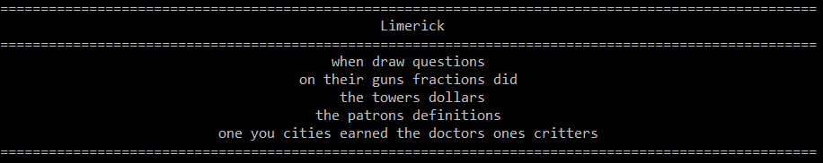
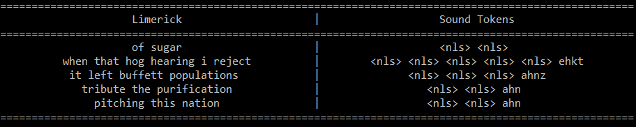

### 1. Set up Environment

> Skip to **Section 2** if you have Pytorch 1.4 and Gensim 3.8.1 installed on a Python 3.8 environment.

1. Download and install [`Anaconda`](https://www.anaconda.com/)
2. Start `Anaconda Prompt`
3. Change directory to where the `pytorch_env.yml` file is.
4. Open the `pytorch_env.yml`, change the first line `name` and last line `prefix` of the file to your preferred name and location. 
5. Install the environment using `conda env create -f pytorch_env.yml`
6. Activate the environment `conda activate pytorch_env` (update the command according to the name you specified in step 4, if you made changes).

### 2. Generate Limericks

1. Make sure you are in the directory `limerick`. (Change directory using `cd limerick` if you just completed the last step of setting up).

2. Run the script `generate.py `. Flag options:

   | Flag      | Options              | Description                                            |
   | --------- | -------------------- | ------------------------------------------------------ |
   | --model   | contx_gru, conv_gru* | Select model for limerick generation.                  |
   | --temp    | Default = 1.0        | Specify the temperature for generation.                |
   | --dropout | Default = 0.0        | Specify the dropout rate before the final dense layer. |

   Example Script : `python generate.py --model conv_gru --temp 1.0 --dropout 0.5`

   > **Convolutional GRU performs better than Contextual GRU, as highlighted in the report.*

3. The necessary files and specified model will be loaded, followed by a display of an interactive command prompt interface, like this:

   ```
   Successfully loaded vocab & special tokens
   Successfully loaded sound to vocab lookup
   Successfully loaded vocab to sound lookup
   Successfully loaded vocab to syllable lookup
   Successfully loaded model conv_gru
   
   Generate a limerick (Y - Yes, S - Yes w Sound Tokens, N - No)? >>> 
   ```

   - Enter **Y** to generate limerick:

     

   - Enter **S** to generate limerick and predicted sound tokens:

     

   - Enter **N** to exit the program.

